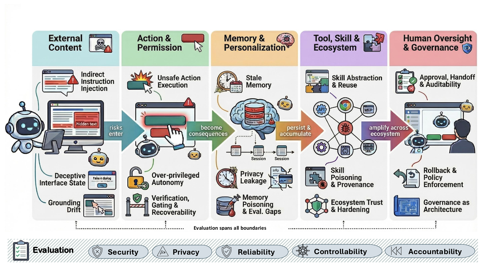

#  Toward Trustworthy Computer-Use Agents: Trust Boundaries, Formal Analysis, Evaluation Gaps, and Human Governance

<p align="center">
  <em>University of California, Davis &nbsp;·&nbsp; The University of Texas at Dallas</em>
</p>

<p align="center">
  <a href="https://doi.org/10.13140/RG.2.2.24516.80000"> 
    
  </a>
</p>

<p align="center"></p>

<p align="center"><em>Figure 1. Running case: Alice’s CUA processes reimbursement emails. A fake receipt’s accessibility-tree injection passes the OCR-
and-DOM pipeline, the agent forwards the thread to a lookalike address (finance-audit@g-mai1.co) through unstaged UI events,
persistent memory stores a poisoned preference, and a third-party reimburse-autofill skill silently exfiltrates telemetry. Approval,
rollback, and attribution arrive too late.</em></p>

<p align="center"></p>

<p align="center"><em>Figure 2. Overview of the survey structure. The five trust boundaries, perception and grounding, action and permission, memory and
privacy, tool/skill/ecosystem, and human oversight and governance, follow the deployment risk propagation path: risks enter, become
consequences, persist, amplify, and are governed.</em></p>

<!-- omit in toc -->
## 📢 Updates

- **2026.04**: We released a GitHub repo to record papers related to trustworthy computer-use agents. Feel free to cite or open pull requests.

---

## 📑 Citation
 
If you find this survey or repository useful, please cite our work:
 
```bibtex
@misc{trustworthy_cua_2026,
  title        = {Toward Trustworthy Computer-Use Agents: Trust Boundaries, Formal Analysis, Evaluation Gaps, and Human Governance},
  author       = {Xu Hu, Haoming Li, Sabbir Ahmed, Md Nahiyan Uddin, Qiannan Li, Jessica Ouyang, Latifur Khan, Feng Chen and Bingzhe Li},
  year         = {2026},
  month        = {May},
  doi          = {10.13140/RG.2.2.24516.80000},
  url          = {https://www.researchgate.net/publication/405422774_Toward_Trustworthy_Computer-Use_Agents_Risk_Propagation_Evaluation_Gaps_and_Human_Governance?channel=doi&linkId=6a190f541d2edf444ddba073&showFulltext=true},
}
```
## 🤝 Contributing

Contributions are very welcome! Please feel free to open an issue or a pull request to add new papers on trustworthy computer-use agents, correct information, or suggest new sections.
